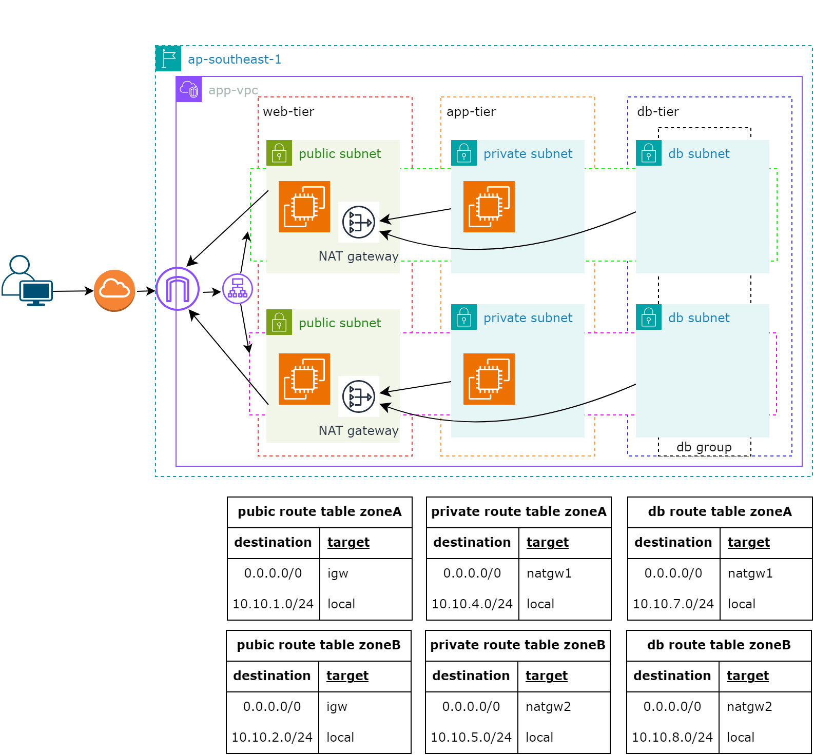

# AWS Multi-Tier Architecture with VPC, NAT Gateways, and RDS

## Overview

This architecture is a secure, scalable, and high-availability deployment in the AWS **ap-southeast-1** region. It utilizes a multi-tier Virtual Private Cloud (VPC) setup, with isolated web, application, and database tiers. The architecture is designed for high availability by spanning resources across two availability zones, while ensuring private subnets are securely configured and have limited internet exposure.

### Key Features:
- **Multi-tier VPC Design**: Separation of resources into public, private, and database tiers.
- **High Availability**: Deployment across multiple availability zones (Zone A and Zone B).
- **NAT Gateways**: Secure outbound internet access for private subnets.
- **Private Subnets**: Secure environment for application and database layers, not exposed to the public internet.
- **Route Tables**: Custom routing to manage traffic flow across the network.
- **Security Groups**: Control access between tiers to restrict unnecessary traffic.
- **Cost Efficiency**: Use of NAT Gateways and private routing for optimal cost and security.

---

## Architecture Diagram

---

## Architecture Components

### 1. **VPC (Virtual Private Cloud)**
   - A VPC that spans two availability zones (Zone A and Zone B) in **ap-southeast-1**.
   - Subnets are divided into three tiers:
     - **Web Tier**: Public subnets used for web servers that need internet access.
     - **App Tier**: Private subnets for application servers, protected from direct internet exposure.
     - **DB Tier**: Private subnets for databases, isolated from public access.

### 2. **Subnets**
   - **Public Subnets (Web Tier)**: These subnets are connected to the internet through an Internet Gateway (IGW) and are used to host resources like web servers that require inbound and outbound internet access.
   - **Private Subnets (App Tier)**: These subnets are not directly accessible from the internet. They use a NAT Gateway for outbound internet access (for updates, etc.), but cannot be accessed from the outside.
   - **DB Subnets (DB Tier)**: Dedicated private subnets used to host database instances (e.g., Amazon RDS Aurora). These subnets are isolated from public access and routed through NAT Gateways for limited outbound internet access when necessary (e.g., for patching).

### 3. **NAT Gateways**
   - **NAT Gateways** are deployed in each availability zone to allow instances in the private subnets (App Tier and DB Tier) to access the internet securely without exposing them to inbound public traffic.
   - This setup ensures that the application servers and database instances have outbound internet connectivity for updates, patches, or integration with external APIs while maintaining strict inbound access control.

### 4. **Route Tables**
   - **Public Route Tables**: These allow internet-bound traffic (0.0.0.0/0) to route through the Internet Gateway (IGW) for the public subnets in the Web Tier.
   - **Private Route Tables**: These route traffic from the private subnets (App Tier and DB Tier) through the NAT Gateways, ensuring that they can initiate outbound connections to the internet (but are not exposed to inbound traffic).
   - **DB Route Tables**: Similar to the private subnets, the database route tables direct traffic through the NAT Gateway, providing limited internet access while keeping the databases secure.

### 5. **Security**
   - **Security Groups** are configured to control traffic between the tiers.
     - For example, the web servers in the public subnet can communicate with the application servers in the private subnet, but the databases in the DB tier are only accessible by the application layer.
   - This design ensures that each tier is isolated from unnecessary traffic while maintaining the necessary communication paths. 
   - **Ingress and Egress Rules** are used to limit the flow of traffic:
     - The **Application Load Balancer (ALB)** only allows inbound traffic from the internet (based on configured ports).
     - The **EC2 instances** are restricted to only receive traffic from the ALB on specific ports.
     - The **RDS database** only accepts traffic from the EC2 instances over the database port (3306 for MySQL).

---

## High Availability

- Resources are deployed across multiple availability zones (Zone A and Zone B), ensuring that the application can handle the failure of one zone.
- **Redundant NAT Gateways** are deployed in both availability zones to ensure that if one NAT Gateway fails, the private subnets still have outbound internet connectivity.
- **Database Subnets** span across multiple availability zones, supporting Amazon Aurora’s multi-AZ configuration for high availability and failover.

---